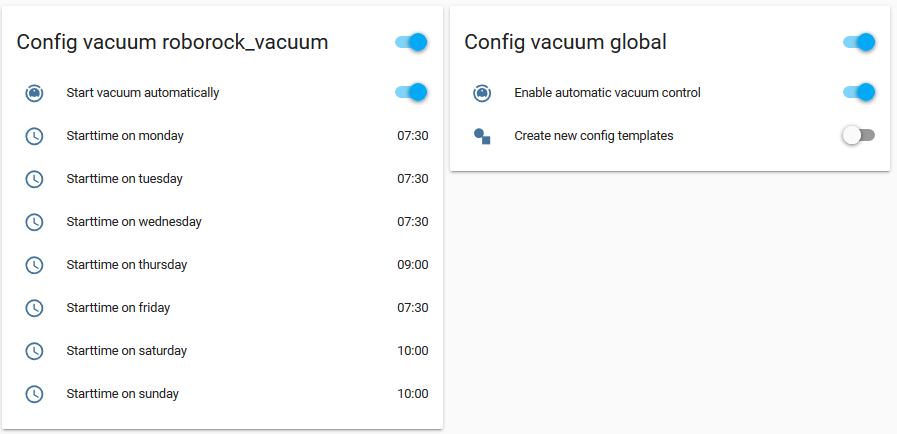

# appdaemon-vacuum-control

Package for automatic vaccum control.

The main features are:
* Vacuums are automatically detected and an example configuration is created to include into your home-assistant configuration
* Each vacuum can be configured differently
* For each day different time can be configured

## Configuration
### appdaemon configuration
Just copy the files
* VacuumControl.py
* Helper.py

to your apps folder of appaemon and add the following configuration to your apps.yaml
```
VacuumConfigConfiguration:
  module:                   VacuumControl
  class:                    VacuumControlConfiguration
  debug:                    True

VacuumControl:
 module:                    VacuumControl
 class:                     VacuumControl
 debug:                     True
```

The file Helper.py is also used by one of my [other](https://github.com/foxcris/appdaemon-blinds-control) appdaemon project. In both projects the same file is used!
### home-assistant configuration
If you use the generated configuration you can directly start using automated blinds control. The following files are created:
* config_vacuum.yaml_
* input_boolean.yaml_
* input_datetime.yaml_
* input_number.yaml_

These files are generated on the first run of the module by appdaemon. You can create new configuration files later on by using a switch in home-assistant.
The suffix _ is added by intention to prevent appdaemon to read the yaml files. The configuration files are generated in your apps folder of appdaemon. 

Just add all the generated configuration variables in
* input_boolean.yaml_
* input_datetime.yaml_
* input_number.yaml_

to your appropriate home-assistant configuration files.
The configuration file
* config_vacuum_.yaml_

includes groups for each vacuum with all the associated variables. Add these configuration file to your group configuration of home-assistant. A new group **config vacuum** should be shown afterwards in your home-assisant instance providing an vacuum configuration for each of your vacuum.


